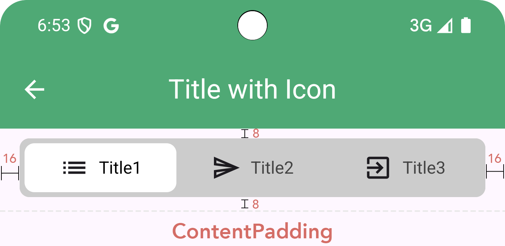

# compose-segmented-tab


## Target platform
- TBD

## Latest version
- Version TBD


## Setup
1. Open the file `settings.gradle`
```groovy
dependencyResolutionManagement {
    repositoriesMode.set(RepositoriesMode.FAIL_ON_PROJECT_REPOS)
    repositories {
        google()
        mavenCentral()
        //TBD
        ...
    }
}
...
```
2. Sync the project
3. Add `compose-segmented-tab` dependency
```groovy
dependencies {
    // TBD
}
```


## Customization

You can customize the component according to the attributes shown below.

| Attribute                | Description   |
| ----------------------   |:-------------:| 
| height| Default 48dp. Segment height | 
| segmentShape|Default RoundedCornerShape(8.dp). Shape of the segment, items and container |
| borderWidt |Default 1.dp. Border of the segment container | 
| borderColor|Default Color.LightGray. Border color of the segment container |
| segmentPadding|Default PaddingValues(all = 4.dp). Padding between segment item and its container. See image below  | 
| segmentBackgroundColor|Default Color.LightGray. Background color of the segment container |
| selectedSegmentedBackgroundColor|Default Color.White. Background color of the selected segment |
| selectedSegmentTextStyle|It is optional. But if you want to customize the font you must to set a path to the font file |
| unselectedSegmentTextStyle|It is optional. But if you want to customize the font you must to set a path to the font file |
| selectedSegmentTextColor|Default Color.Black. Text color of the selected segment |
| unselectedSegmentTextColor|Default Color.DarkGray. Text color of the unselected segment |
| contentPadding|Default PaddingValues(horizontal = 16.dp, vertical = 8.dp). Padding between segment container and content outside.





## How to use
```kotlin  
@Composable
fun MyScreen() {
    Column(
        modifier = Modifier
            .fillMaxSize(),
        horizontalAlignment = Alignment.CenterHorizontally
    ) {
        var selectedSegment by remember { mutableIntStateOf(0) }
        val action = SegmentedTabAction(onSegmentSelected = {
            selectedSegment = it
        })

        val segments = listOf(
            SegmentedTabData(
                type = "Title1",
                title = "Title1",
            ),
            SegmentedTabData(
                type = "Title2",
                title = "Title2",
            ),
            SegmentedTabData(
                type = "Title3",
                title = "Title3",
            )
        )

        Column {
            SegmentedTab(
                state = SegmentedTabState(
                    segments = segments,
                    selectedSegment = selectedSegment,
                ),
                action = action
            )

            // Change content according to selected item
            Box(
                modifier = Modifier
                    .fillMaxWidth()
                    .weight(1f)
                    .background(Color.LightGray.copy(alpha = 0.2f)),
                contentAlignment = Alignment.Center
            ) {
                Text("Selected type:${selectedSegment.plus(1)}")
            }
        }
    }
}
```
- There are other examples on the app module also, don't be afraid to check. :D

# License
```  
Copyright (c) 2025 Marlon Mafra  
  
Permission is hereby granted, free of charge, to any person obtaining  
a copy of this software and associated documentation files (the  
"Software"), to deal in the Software without restriction, including  
without limitation the rights to use, copy, modify, merge, publish,  
distribute, sublicense, and/or sell copies of the Software, and to  
permit persons to whom the Software is furnished to do so, subject to  
the following conditions:  
  
The above copyright notice and this permission notice shall be  
included in all copies or substantial portions of the Software.  
  
THE SOFTWARE IS PROVIDED "AS IS", WITHOUT WARRANTY OF ANY KIND,  
EXPRESS OR IMPLIED, INCLUDING BUT NOT LIMITED TO THE WARRANTIES OF  
MERCHANTABILITY, FITNESS FOR A PARTICULAR PURPOSE AND  
NONINFRINGEMENT. IN NO EVENT SHALL THE AUTHORS OR COPYRIGHT HOLDERS BE  
LIABLE FOR ANY CLAIM, DAMAGES OR OTHER LIABILITY, WHETHER IN AN ACTION  
OF CONTRACT, TORT OR OTHERWISE, ARISING FROM, OUT OF OR IN CONNECTION  
WITH THE SOFTWARE OR THE USE OR OTHER DEALINGS IN THE SOFTWARE.  
```